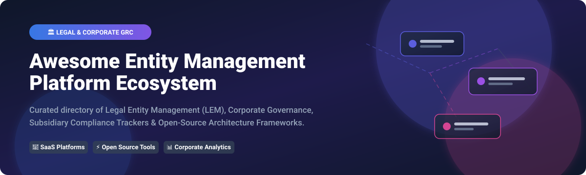
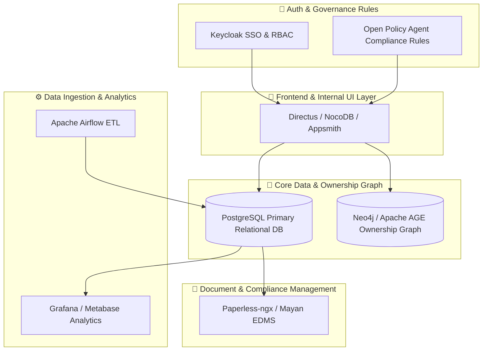

  

  
  
  
  

---

# 🏛️ Awesome Legal Entity Management (LEM) & Corporate Governance Ecosystem 🚀

> **A curated, SEO-optimized directory of enterprise SaaS products, open-source legal-tech projects, subsidiary trackers, compliance databases, and governance frameworks.**

---

## 📌 Executive Summary & Market Insights

The global **Legal Entity Management (LEM) & Corporate Governance Software Market** is estimated at **$1.85 Billion USD (2026)** and is projected to surpass **$3.6 Billion USD by 2032**, growing at a CAGR of **~11.8%**. 

### 📊 Market Structure & Fragmentation
The LEM sector is **moderately fragmented**, consisting of three primary categories:
1. **Established Enterprise Suites** *(e.g., Wolters Kluwer CT Corporation, CSC Global, Diligent Corporation, Computershare)* serving Fortune 500 multinationals with multi-jurisdictional statutory filing services.
2. **Cloud-Native Scaleups & Vertical SaaS** *(e.g., Athennian, EntityKeeper, Corporify)* modernizing equity tracking, org charts, automated compliance deadlines, and digital board recordkeeping.
3. **Open-Source Building Blocks & Self-Hosted Infrastructure** *(e.g., PostgreSQL, Graph DBs, Supabase, Paperless-ngx, Probo GRC)* enabling developers and in-house legal-ops teams to build custom, highly secure entity management portals.

---

## 📑 Table of Contents

- [💼 Enterprise SaaS & Hosted Platforms](#-enterprise-saas--hosted-platforms)
- [⚡ Open-Source GitHub Projects](#-open-source-github-projects)
- [🏗️ Self-Hosted Architecture Blueprint](#-self-hosted-architecture-blueprint)
- [🤝 How to Contribute](#-how-to-contribute)
- [💖 Support & Sponsorship](#-support--sponsorship)
- [📈 Star History](#-star-history)
- [⚠️ Disclaimer](#%EF%B8%8F-disclaimer)

---

## 💼 Enterprise SaaS & Hosted Platforms

> **Sorted by Company Size / Estimated Annual Revenue / Market Valuation (Descending)**

The following table details leading hosted platforms designed for legal, tax, finance, and corporate secretarial teams to maintain corporate records, subsidiary org charts, director/officer appointments, statutory filings, and compliance calendars.

| 🏢 Platform | 🌐 Website & Summary | 💰 Starting Price | ⏱️ Free Tier / Trial Limits | 📊 Company Size / Valuation / Revenue |
| :--- | :--- | :--- | :--- | :--- |
| **CT Corporation hCue** | [Wolters Kluwer hCue](https://www.wolterskluwer.com) — Enterprise corporate compliance, subsidiary management, and legal filing software. | **~$12,000 / year** *(Enterprise subscription quote)* | **No free tier** *(14-day guided enterprise demonstration on request)* | **~$6.0 Billion** *(Wolters Kluwer Annual Revenue)* |
| **GEMS by Computershare** | [Computershare GEMS](https://www.computershare.com) — Global entity management system centralizing ownership data, governance, and filings. | **~$18,000 / year** *(Enterprise multi-entity quote)* | **No free tier** *(14-day product walkthrough on request)* | **~$1.8 Billion** *(Computershare Group Annual Revenue)* |
| **ViewPoint** | [Vistra Group / ViewPoint](https://www.vistra.com) — Corporate entity administration software for legal entities, trust structures, and compliance. | **~$12,500 / year** *(Custom enterprise quote)* | **No free tier** *(Guided sandbox demo on request)* | **~$1.5 Billion+** *(Vistra Group Annual Revenue)* |
| **CSC Entity Management** | [CSC Global](https://www.cscglobal.com) — Centralized legal entity management, org charts, compliance calendars, and registered agent services. | **~$15,000 / year** *(Up to 50 entities tier)* | **No free tier** *(14-day interactive demo on request)* | **~$1.2 Billion** *(CSC Estimated Annual Revenue)* |
| **Diligent Entities** | [Diligent Corporation](https://www.diligent.com) — Enterprise governance suite for subsidiary management, corporate records, and board compliance. | **~$20,000 / year** *(Enterprise platform quote)* | **No free tier** *(14-day tailored trial on request)* | **~$600 Million ARR** *(Valued at $4.0B+)* |
| **SimpleLegal** | [Onit / SimpleLegal](https://www.simplelegal.com) — Legal operations and matter management connecting legal entities with corporate workflows. | **~$10,000 / year** *(Base platform fee)* | **No free tier** *(14-day product demo on request)* | **~$100 Million+** *(Onit Group Annual Revenue)* |
| **DiliTrust** | [DiliTrust](https://www.dilitrust.com) — Legal management and governance platform covering corporate legal records, board portals, and compliance. | **~$10,000 / year** *(Module-based quote)* | **No free tier** *(14-day executive demo on request)* | **~$50 Million+ ARR** *(300+ Employees)* |
| **Athennian** | [Athennian](https://www.athennian.com) — Cloud-native Entity Management & Governance Ops platform automating corporate secretarial workflows. | **$25,000 / year** *(Essentials tier up to 100 entities)* | **No free tier** *(14-day interactive sandbox demo on request)* | **~$8.9 Million ARR** *($46.7M Funding Raised)* |
| **Harbor Compliance** | [Harbor Compliance](https://www.harborcompliance.com) — Software for corporate filings, registered agent services, licenses, and entity compliance tracking. | **$99 / year** *(Starting registered agent & basic software package)* | **No free tier** *(Interactive software demo on request)* | **~$25 Million** *(Estimated Annual Revenue)* |
| **Corporatek EnGlobe** | [Corporatek](https://www.corporatek.com) — Enterprise legal entity management for subsidiary governance, D&O management, and regulatory filings. | **~$8,000 / year** *(Starting corporate tier)* | **No free tier** *(14-day guided trial on request)* | **~$20 Million** *(Estimated Annual Revenue)* |
| **EntityKeeper** | [EntityKeeper](https://www.entitykeeper.com) — Centralized entity records, organizational chart generation, document storage, and compliance deadline tracking. | **$5,000 / year** *(Flat rate tier up to 100 entities)* | **No free tier** *(14-day full feature demo on request)* | **~$10 Million** *(Estimated Annual Revenue)* |
| **Corporify** | [Corporify](https://www.corporify.com) — Corporate governance and legal entity platform for ownership structures, documents, and compliance tracking. | **€6,000 / year** *(~ $6,500/year base tier)* | **No free tier** *(Guided software presentation on request)* | **~$5 Million** *(Estimated Annual Revenue)* |

---

## ⚡ Open-Source GitHub Projects

> **Sorted by GitHub Stars_Count (Descending)**

Open-source building blocks, self-hosted applications, databases, document management engines, workflow orchestrators, and open standards for constructing custom entity management systems.

| 📦 Project & Description | ⭐ GitHub_Stars | 🏷️ Category & Tech Stack |
| :--- | :--- | :--- |
| **[Supabase](https://github.com/supabase/supabase)** — Open-source Firebase alternative providing relational Postgres databases, auth, and APIs for custom entity management backends. |  | 🗄️ Backend / Database |
| **[Grafana](https://github.com/grafana/grafana)** — Observability & visualization platform for building entity-compliance calendars, KPI metrics, and filing deadline dashboards. |  | 📊 Analytics & Dashboards |
| **[Apache Superset](https://github.com/apache/superset)** — Business intelligence platform for querying and visualizing entity portfolios, jurisdiction coverage, and ownership structures. |  | 📊 Analytics & BI |
| **[Strapi](https://github.com/strapi/strapi)** — Open-source headless CMS serving as a flexible data-management layer for entities, officers, documents, and corporate records. |  | 🌐 Headless CMS |
| **[NocoDB](https://github.com/nocodb/nocodb)** — Open-source Airtable alternative transforming relational entity data into collaborative tables, forms, and automated compliance workflows. |  | 📋 Low-Code Database |
| **[Odoo Community](https://github.com/odoo/odoo)** — Open-source ERP suite extendable with legal entity, subsidiary management, approval workflow, and contact modules. |  | 🏢 ERP & Business Suite |
| **[Metabase](https://github.com/metabase/metabase)** — BI and analytics tool for fast reporting across corporate legal records, ownership structures, and compliance datasets. |  | 📊 Business Intelligence |
| **[Apache Airflow](https://github.com/apache/airflow)** — Workflow orchestration engine to automate entity-data synchronization, regulatory imports, and scheduled compliance alerts. |  | ⚙️ Workflow Automation |
| **[Paperless-ngx](https://github.com/paperless-ngx/paperless-ngx)** — Self-hosted document management system with OCR, indexing, and tagging for corporate resolutions, incorporation certificates, and filings. |  | 📄 Document Management |
| **[ToolJet](https://github.com/ToolJet/ToolJet)** — Low-code application builder for creating custom internal entity management tools, compliance portals, and executive dashboards. |  | 🛠️ Internal Tool Builder |
| **[Appsmith](https://github.com/appsmithorg/appsmith)** — Low-code admin panel framework for rapidly assembling entity registries, director approval flows, and governance dashboards. |  | 🛠️ Internal Tool Builder |
| **[ERPNext](https://github.com/frappe/erpnext)** — Full-featured open-source ERP with flexible modules for legal entity records, corporate structure, document tracking, and governance. |  | 🏢 Enterprise Resource Planning |
| **[Directus](https://github.com/directus/directus)** — Headless data platform providing auto-generated REST/GraphQL APIs and an admin UI over SQL entity databases. |  | 🔌 Data Engine & API |
| **[Keycloak](https://github.com/keycloak/keycloak)** — Enterprise identity and access management platform offering SSO, role-based access control, and security for entity platforms. |  | 🔐 Auth & Security |
| **[Nextcloud Server](https://github.com/nextcloud/server)** — Enterprise cloud storage and collaboration platform for hosting governance files, board packs, and legal entity archives. |  | ☁️ Cloud Collaboration |
| **[Hasura GraphQL Engine](https://github.com/hasura/graphql-engine)** — Instant real-time GraphQL API engine over Postgres for entity relationship queries and officer permissions. |  | ⚡ API Infrastructure |
| **[Budibase](https://github.com/Budibase/budibase)** — Open-source low-code platform for building legal entity registries, internal compliance portals, and approval forms. |  | 🛠️ Low-Code Application |
| **[PostgreSQL](https://github.com/postgres/postgres)** — World's most advanced open-source relational database, serving as the foundational system of record for entity data. |  | 🗄️ Relational DB |
| **[Neo4j](https://github.com/neo4j/neo4j)** — Graph database platform for modeling complex parent-subsidiary hierarchies, ultimate beneficial owners (UBO), and shareholding trees. |  | 🕸️ Graph Database |
| **[OpenProject](https://github.com/opf/openproject)** — Open-source project management platform for tracking corporate restructurings, M&A filings, entity formations, and audits. |  | 📅 Project Management |
| **[ArangoDB](https://github.com/arangodb/arangodb)** — Native multi-model database (document + graph) ideal for storing entity profiles alongside complex ownership graphs. |  | 🕸️ Multi-Model DB |
| **[OpenSearch](https://github.com/opensearch-project/OpenSearch)** — Distributed search engine for fast, full-text searching across legal entity registries, filings, and corporate documents. |  | 🔍 Search Engine |
| **[Open Policy Agent (OPA)](https://github.com/open-policy-agent/opa)** — Policy engine for declaring fine-grained compliance rules, permission structures, and approval logic. |  | 🛡️ Policy & Governance |
| **[OpenRefine](https://github.com/OpenRefine/OpenRefine)** — Data cleaning tool for deduplicating corporate records, normalizing entity names, and processing public registry extracts. |  | 🧹 Data Cleansing |
| **[Frappe Framework](https://github.com/frappe/frappe)** — Python & JS web framework optimized for building custom compliance apps, audit logs, and entity records. |  | 🐍 Web Framework |
| **[Apache NiFi](https://github.com/apache/nifi)** — Dataflow automation tool for ingesting, transforming, and routing entity records between external registries and internal DBs. |  | 🔄 Data Ingestion |
| **[Baserow](https://github.com/baserow/baserow)** — Open-source no-code database tool for managing lightweight legal entity tables, officer lists, and compliance calendars. |  | 📋 No-Code DB |
| **[CKAN](https://github.com/ckan/ckan)** — Open-source data management system for publishing public company registries and structured corporate open-data sets. |  | 🌐 Data Portal |
| **[Apache AGE](https://github.com/apache/age)** — PostgreSQL graph extension for querying ownership networks and shareholder relations using Cypher syntax inside SQL. |  | 🕸️ Postgres Graph |
| **[Probo GRC](https://github.com/getprobo/probo)** — Open-source GRC platform for managing corporate governance, controls, vendor risk, and compliance evidence. |  | 🛡️ Open GRC |
| **[Docspell](https://github.com/docspell/docspell)** — Document management system with automatic metadata extraction, OCR, and tagging for corporate compliance files. |  | 📄 Document Management |
| **[Mayan EDMS](https://github.com/mayan-edms/Mayan-EDMS)** — Electronic document management system for maintaining board resolutions, certificates, and statutory records. |  | 📄 Document Repository |
| **[OpenSanctions](https://github.com/opensanctions/opensanctions)** — Open dataset and pipeline for international sanctions, PEPs, and entity due-diligence screening. |  | 🔍 Compliance Screening |

---

## 🏗️ Self-Hosted Architecture Blueprint

Want to build a modern, scalable, self-hosted Legal Entity Management platform? Here is the recommended open-source stack combination:

---

## 🤝 How to Contribute

Contributions are welcome! To submit a new tool, SaaS platform, or open-source project:

1. 🍴 **Fork** this repository.
2. 📝 **Add your entry** to `README.md` maintaining alphabetical or star/revenue sorting order.
3. 📌 Include the **Name**, **Link**, **Pricing/Stars**, and a concise **1-2 sentence description**.
4. 🚀 **Open a Pull Request** with a brief explanation.

Please check [Awesome-Awesome-Awesome](https://github.com/ishandutta2007/Awesome-Awesome-Awesome) for contribution guidelines across our curated awesome list network!

---

## 💖 Support & Sponsorship

If you found this repository helpful, please consider supporting the project!

- ⭐ **Star this repository** to help others discover it.
- 🔀 **Fork & Share** with your legal-tech, governance, and developer networks.
- 💬 **Join our Discord** on the [Discord Community](https://discord.gg/jc4xtF58Ve) to discuss entity management platforms!
- ☕ **Sponsor the Maintainer**: Support ongoing curation and open-source updates via the [GitHub Sponsor Dashboard](https://github.com/sponsors/ishandutta2007).

---

## 📈 Star History

---

## ⚠️ Disclaimer

*This repository is a community-curated directory for informational purposes only and does not constitute legal, tax, or regulatory advice.* Software pricing, features, company metrics, and licensing terms are subject to change by respective vendors. Organizations should independently verify compliance requirements with qualified corporate secretaries and legal professionals.

---

  Made with ❤️ for corporate legal teams, company secretaries, governance professionals, compliance officers, and developers building open entity technology.

